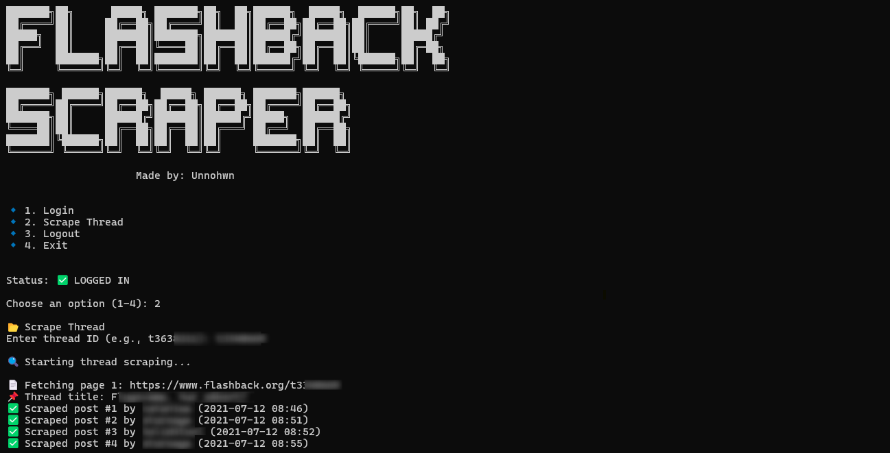

# Flashback Forum Scraper

A simple python script to scrape threads from Flashback Forum.

  
  <p><i>Screenshot</i></p>

## Features
- Scrape entire threads
- Auto Exports to CSV file
- Auto-retry on connection errors

## Requirements
See [requirements.txt](requirements.txt) for full list of dependencies.

## Installation
```bash
# Clone the repository
git clone https://github.com/unnohwn/flashback-scraper.git
cd flashback-scraper

# Install required packages
pip install -r requirements.txt
```

## Usage
```bash
# Run the script
python flashback-scraper.py

# Follow the menu options:
1. Login with your Flashback credentials
2. Enter a thread ID (e.g., t3638211)
3. Wait for scraping to complete
```

## Output
The script creates CSV files with the following format:
`thread_[ID]_[TIMESTAMP].csv`

## Note
- You need a valid Flashback account to use this script
- Respect the forum's rules and terms of service

## License
This project is licensed under the MIT License - see the [LICENSE](LICENSE) file for details.
